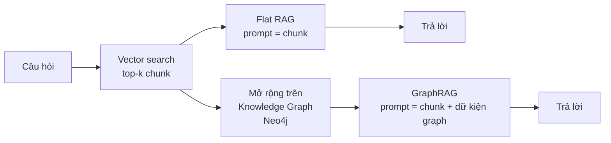
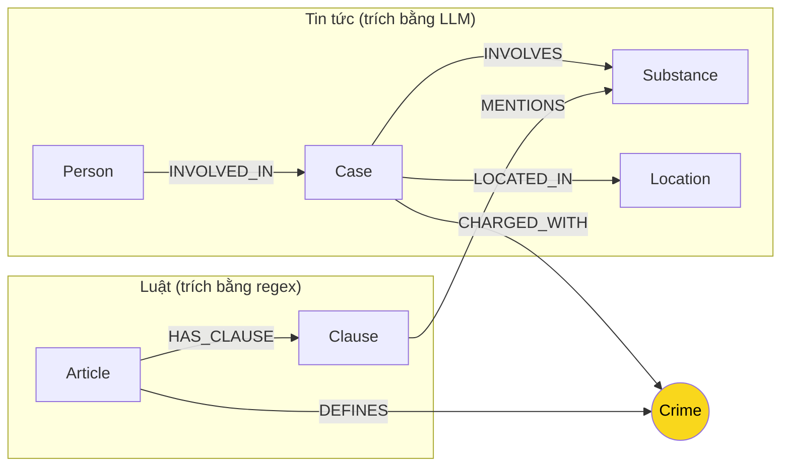

# Day 19 — Knowledge Graph: Flat RAG vs GraphRAG

Đọc theo thứ tự:

1. **README.md** (file này): lab về cái gì, vì sao.
2. **[LAB_GUIDE.md](LAB_GUIDE.md)**: hướng dẫn từng bước và cách xử lý lỗi.
3. **[SUBMISSION.md](SUBMISSION.md)**: kỳ vọng đầu ra, thang điểm, cách nộp.

## Bối cảnh

Bạn đã có một hệ thống RAG chạy được: chunking, vector store, agent. Nó trả lời tốt câu hỏi mà đáp án **nằm gọn trong một đoạn văn**. Lab này đặt câu hỏi: **khi đáp án nằm rải rác ở nhiều nguồn khác nhau, RAG có còn đủ không? Nếu phải thêm Knowledge Graph thì tốn thêm bao nhiêu?**

Bạn làm việc với **2 cơ sở tri thức (knowledge base, KB)** về ma túy:

| KB | Nội dung | Đặc điểm |
| --- | --- | --- |
| **Luật** (`data/drug_law/`) | BLHS 2015 (sửa đổi 2017) Chương XX "Các tội phạm về ma túy" và Luật Phòng, chống ma túy 2021 Chương I. Mỗi file là một Điều | Cấu trúc rất đều: Điều → khoản → điểm, khung hình phạt, khối lượng chất |
| **Tin tức** (`data/drug_news/`) | 20 bài báo tuoitre.vn về các vụ án ma túy | Văn xuôi tự do: tên người, tội danh, chất, khối lượng, mức án |

Một câu hỏi điển hình:

> *"Bị cáo X bị tuyên bao nhiêu năm tù, về tội gì, tội đó quy định ở Điều nào, khung hình phạt bao nhiêu?"*

Tên bị cáo và mức án chỉ có trong **tin tức**, còn Điều luật và khung hình phạt chỉ có trong **luật**. Không có đoạn văn nào chứa cả hai.

## Bạn sẽ xây gì

Hai pipeline hỏi đáp trên cùng dữ liệu, cùng LLM:



Knowledge Graph phải nối được 2 KB qua một **node cầu nối**. **Ontology (entity, relationship) do bạn tự thiết kế.** Dưới đây là **ontology gợi ý** có sẵn trong code, trong đó cầu nối là `Crime` (tội danh). Bạn được dùng nguyên, sửa, hoặc thay bằng thiết kế của riêng mình (tự thiết kế được bonus +15):



Sau đó bạn **đo**: độ chính xác, số token, chi phí USD, độ trễ của cả 2 pipeline, ở cả lúc dựng hệ thống lẫn lúc trả lời. Bạn cũng **tìm lỗi** trong graph và câu trả lời.

## Mục tiêu học tập

Sau lab, bạn có thể:

1. **Thiết kế ontology** (entity, relationship, khóa định danh) cho Knowledge Graph nối nhiều nguồn dữ liệu; giải thích vai trò của **node cầu nối** và kiểm chứng thiết kế bằng competency questions.
2. Chọn cách trích xuất phù hợp với từng loại văn bản: **regex** cho văn bản có cấu trúc, **LLM** cho văn xuôi. Nêu được ưu nhược của mỗi cách.
3. Viết **Cypher** đi nhiều bước (multi-hop) trên Neo4j.
4. Đo và so sánh **chi phí** (token, USD, thời gian) giữa Flat RAG và GraphRAG, tách riêng chi phí dựng hệ thống và chi phí mỗi câu hỏi.
5. Chẩn đoán lỗi điển hình của GraphRAG: cầu nối gãy, trùng thực thể, thiếu ngữ cảnh, LLM lệch với graph, và lỗi của chính phép đo.
6. Trả lời *"khi nào Knowledge Graph đáng tiền?"* bằng số liệu tự đo.

## Bạn cần làm gì (tóm tắt)

| Phần | Nội dung | Ở đâu |
| --- | --- | --- |
| Thiết kế | Ontology cho 2 KB → `report/ONTOLOGY.md` (bắt buộc; tự thiết kế khác gợi ý được bonus +15) | LAB_GUIDE Bước 2 |
| Code | 4 TODO trong `src/graph.py`: chuẩn hóa entity (KG-1), dựng graph (KG-2), Cypher multi-hop xuyên 2 KB (KG-3), agent GraphRAG (KG-4) | LAB_GUIDE Bước 3–6 |
| Đo | Chạy benchmark 6 câu hỏi qua 2 pipeline | LAB_GUIDE Bước 7 |
| Phân tích | Khám phá graph trên Neo4j Browser, tìm và chứng minh lỗi | LAB_GUIDE Bước 8 |
| Báo cáo | `report/REPORT_KG.md` + 3 ảnh chụp Neo4j Browser | SUBMISSION |

Phần base (chunking, vector store, agent RAG) **đã có sẵn và chạy được**; bạn không phải viết lại.

## Yêu cầu

- **Kiến thức:** Python, RAG cơ bản (embedding, top-k retrieval). Chưa cần biết Neo4j hay Cypher; guide có hướng dẫn.
- **Công cụ:** Python 3.11, Docker Desktop, Git, và API key của **ít nhất một provider**: OpenAI (chính), OpenRouter, Gemini hoặc Anthropic. Nếu chỉ dùng Anthropic cho chat, cần thêm OpenAI/OpenRouter/Gemini cho embedding vì Anthropic không có embedding API.
- **Chi phí API:** khoảng **0,01–0,05 USD** cho mỗi lần chạy benchmark (`gpt-4o-mini`).
- **Thời gian:** khoảng 5 giờ (setup 20', thiết kế ontology 40', code 2 giờ, benchmark và phân tích 1 giờ, báo cáo 40').

## Cấu trúc repo

```
├── README.md             ← tổng quan (file này)
├── docs/img/             ← ảnh mẫu Neo4j Browser (dùng trong LAB_GUIDE)
├── LAB_GUIDE.md          ← hướng dẫn từng bước + xử lý lỗi
├── SUBMISSION.md         ← kỳ vọng, thang điểm, cách nộp
├── bench_kg.py           ← benchmark Flat vs Graph (--check: tự kiểm, < 0,001 USD)
├── data/
│   ├── drug_law/         ← KB luật (1 file/Điều) + sources.csv
│   ├── drug_news/        ← KB tin (1 file/bài) + sources.csv
│   └── benchmark_kg.json ← 6 câu hỏi, đáp án chuẩn, từ khóa bắt buộc
├── src/
│   ├── graph.py          ← ★ TODO KG-1..KG-4 + ontology gợi ý (HINT)
│   ├── llm.py            ← OpenAI chính + OpenRouter/Gemini/Anthropic dự phòng, có đo token/USD/giây
│   └── chunking.py, store.py, agent.py, embeddings.py, models.py  ← base RAG (có sẵn)
├── scripts/
│   ├── crawl_drug_corpus.py   ← crawl lại 2 KB
│   └── fetch_public_pages.py  ← tiện ích crawl trang công khai
├── tests/
│   ├── test_base.py      ← kiểm tra base RAG (đã pass sẵn)
│   └── test_graph.py     ← kiểm tra KG-1, KG-4 (KG-2, KG-3 kiểm bằng --check)
└── report/               ← ONTOLOGY.md + REPORT_KG.md + ảnh của bạn
```

## Nguồn dữ liệu

- **Luật:** lấy từ vi.wikisource.org. Văn bản quy phạm pháp luật không thuộc đối tượng bảo hộ quyền tác giả.
- **Tin tức:** lấy từ tuoitre.vn; robots.txt cho phép; chỉ dùng cho mục đích học tập.
- URL và ngày lấy của từng file nằm trong `sources.csv`.
- Nội dung là văn bản pháp luật và tin tức công khai, dùng cho mục đích kỹ thuật. Câu trả lời của hệ thống **không phải tư vấn pháp lý**.

## Bản triển khai trong repo này

Đã hoàn thành KG-1–KG-4 và **ontology bonus** với 12 label, 15 loại cạnh. Thiết kế thêm nguồn/báo cáo, Participation theo người và nguồn, DrugFinding + Threshold đối chiếu lượng, Penalty + MAX_PENALTY tìm khung cao nhất. Cấu hình `.env.example` chọn **OpenRouter cho cả chat và embedding**: `openai/gpt-4o-mini` và `openai/text-embedding-3-small`. Điền `OPENROUTER_API_KEY` trong `.env`; không đưa key vào code hoặc báo cáo.

Chạy trong PowerShell, tại thư mục repo sau khi cài `requirements.txt` và khởi động Neo4j:

```powershell
$env:PYTHONIOENCODING='utf-8'
.venv/Scripts/python.exe -m pytest tests/ -q
.venv/Scripts/python.exe -u bench_kg.py --check
.venv/Scripts/python.exe -u bench_kg.py --judge
.venv/Scripts/python.exe scripts/audit_kg.py
.venv/Scripts/python.exe scripts/compare_bonus.py
```

Chạy `--check` **trước** benchmark vì check thay graph bằng luật + một bài báo. Sau `--judge`, graph đầy đủ còn tại http://localhost:7474. Kết quả ngày 05/10/2026: **58 test pass** (48 gốc + 10 bonus), 7 dòng check OK, **360 node / 691 cạnh**; recall Flat 0,43 và Graph 1,00, judge tương ứng 1,00 và 1,83. Q6 vẫn còn lỗi phân biệt người và vụ; chi tiết nằm trong [báo cáo](report/REPORT_KG.md), [ontology](report/ONTOLOGY.md) và [benchmark](ket_qua_benchmark_kg.txt).

Baseline ontology gợi ý được giữ nguyên trong [ket_qua_benchmark_kg.hint.txt](ket_qua_benchmark_kg.hint.txt), `src/hint_graph.py` và `report/hint/`. Graph bonus so với baseline: recall **0,89 → 1,00**, judge **1,67 → 1,83**, chi phí mỗi câu **0,00071 → 0,00053 USD**; indexing tăng từ 0,00929 lên 0,01145 USD. Báo cáo mục 6 so sánh trước/sau và mục 7 ONTOLOGY giải thích các khác biệt. `scripts/compare_bonus.py` kiểm tra hash baseline, số liệu và sinh báo cáo từ các file thực tế; cần giữ log test/check khớp lần đo.

Để chạy lại ontology gợi ý mà vẫn giữ file baseline gốc:

```powershell
$env:LAB_SOLUTION_PACKAGE='src_hint'
.venv/Scripts/python.exe bench_kg.py --judge --out ket_qua_benchmark_kg.hint.rerun.txt
Remove-Item Env:LAB_SOLUTION_PACKAGE
```

Lệnh này thay graph hiện tại; chạy lại pipeline bonus, audit, chụp ảnh và sinh báo cáo để khôi phục bộ bằng chứng cuối.

Chụp lại ba ảnh thật trên Windows có Chrome:

```powershell
.venv/Scripts/python.exe -m pip install -r requirements-browser.txt
.venv/Scripts/python.exe scripts/capture_neo4j.py
```

Script chụp nguyên cửa sổ Neo4j Browser sau mỗi truy vấn và lưu `report/img/`; bằng chứng truy vấn read-only được lưu bởi `scripts/audit_kg.py`. Nếu đo lại, cập nhật báo cáo và ảnh để khớp graph mới. Bài làm được commit cục bộ theo yêu cầu; **chưa push**.
