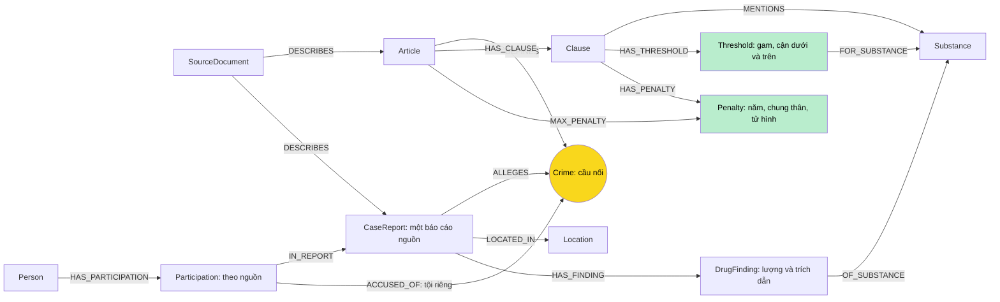

# Thiết kế Ontology — Day 19 (Bonus)

**Họ tên:** Mai Văn Trung  **MSSV:** 2A202602513

- [ ] Dùng ontology gợi ý.
- [x] Tự thiết kế có chủ đích, đề nghị xét bonus +15.

Ontology cũ và kết quả gốc được giữ tại `src/hint_graph.py`, `report/hint/` và `ket_qua_benchmark_kg.hint.txt`. Ontology mới không chỉ đổi tên: thêm nguồn, thông tin tố tụng theo nguồn, bằng chứng khối lượng, ngưỡng số và khung hình phạt có thứ tự.

## 1. Sơ đồ

## 2. Entity types

| Label | Ý nghĩa | Khóa MERGE | Properties | KB | Trích xuất |
| --- | --- | --- | --- | --- | --- |
| SourceDocument | Một tài liệu nguồn, kể cả bài không trích ra vụ | id=Document.id | doc_id, title, kb, url, version, excluded_teasers | Cả hai | Metadata; so khớp teaser |
| Article | Một điều trong phiên bản corpus | id: Điều + số + tên luật | doc_id, title, law | Luật | Metadata/regex |
| Clause | Một khoản | id: điều + khoản | doc_id, number, text, penalty | Luật | Regex |
| Crime | Tội danh chuẩn | name | name | Cả hai | Tiêu đề luật; LLM và link_entity |
| CaseReport | Báo cáo về vụ chính trong một bài, không phải mã vụ toàn cục | id=doc_id của bài | doc_id, name, summary, date | Tin | LLM JSON, sau lọc teaser |
| Person | Tên đầy đủ chuẩn hóa Unicode | id=NFC + casefold + khoảng trắng | name, aliases, doc_id nguồn đầu | Tin | LLM; tên phải xuất hiện trong nguồn |
| Participation | Vai trò/tội/án của người tại thời điểm bài báo | id=doc_id + id người | doc_id, role, stage, sentence, evidence, verified | Tin | LLM theo người; kiểm tra trích dẫn |
| DrugFinding | Một bằng chứng chất và lượng theo nguồn/chủ thể | id=doc_id + hash bằng chứng; loại tổng có prefix riêng | doc_id, amount, mass_g, qualifier, subject, evidence, verified, quantity_verified, evidence_type | Tin | LLM + kiểm trích dẫn + regex đơn vị/tổng lượng |
| Substance | Tên hóa chất hoặc chất nguồn nêu | name | name | Cả hai | Tên chuẩn; không suy thuốc lắc thành MDMA |
| Location | Tỉnh/thành phố của báo cáo | name | name | Tin | LLM |
| Threshold | Ngưỡng khối lượng cho một điểm luật nêu chất cụ thể | id=Clause.id + điểm | doc_id, point, min_g, max_g, lower_inclusive, upper_inclusive, text | Luật | Regex + đổi đơn vị |
| Penalty | Khung phạt tù của một khoản, kèm mức độ để so sánh | id=Clause.id + /penalty | doc_id, text, min_years, max_years, life, death, severity | Luật | Regex; xếp hạng tất định |

Mọi node hình thành riêng từ một tài liệu có doc_id. Crime, Substance và Location là danh mục dùng chung. Person giữ doc_id đầu tiên nhưng nguồn đúng của từng phát biểu nằm ở Participation → CaseReport ← SourceDocument. Định danh Person theo tên vẫn có nguy cơ gộp người trùng tên; không tuyên bố đã giải quyết danh tính pháp lý.

## 3. Relationships

| Type | Từ → Đến | Properties | Ý nghĩa |
| --- | --- | --- | --- |
| DESCRIBES | SourceDocument → Article hoặc CaseReport | Không | Neo phát biểu vào tài liệu gốc |
| DEFINES | Article → Crime | Không | Căn cứ định nghĩa tội |
| HAS_CLAUSE | Article → Clause | Không | Các khoản của điều |
| MENTIONS | Clause → Substance | Không | Chỉ nhắc chất; không đủ để kết luận áp dụng khoản |
| HAS_THRESHOLD | Clause → Threshold | Không | Điểm luật có ngưỡng khối lượng |
| FOR_SUBSTANCE | Threshold → Substance | Không | Chất được quy tắc ngưỡng nêu rõ |
| HAS_PENALTY | Clause → Penalty | Không | Khung hình phạt của khoản |
| MAX_PENALTY | Article → Penalty | Không | Khung nặng nhất được tính khi dựng graph |
| ALLEGES | CaseReport → Crime | Không | Tội ở phạm vi báo cáo; không tự quy cho tất cả người |
| LOCATED_IN | CaseReport → Location | Không | Địa điểm vụ được báo cáo |
| HAS_PARTICIPATION | Person → Participation | Không | Phát biểu theo nguồn của một người |
| IN_REPORT | Participation → CaseReport | Không | Phạm vi của role/stage/sentence |
| ACCUSED_OF | Participation → Crime | Không | Tội riêng được trích cho người tại nguồn đó |
| HAS_FINDING | CaseReport → DrugFinding | Không | Bằng chứng chất/lượng trong nguồn |
| OF_SUBSTANCE | DrugFinding → Substance | Không | Chất của bằng chứng |

Graph có đúng **12 label và 15 loại cạnh**; mã dựng nằm trong `src/graph.py`, quy tắc số và teaser trong `src/legal_evidence.py`. Constraint UNIQUE theo các khóa ở mục 2; dữ liệu Cypher truyền bằng tham số.

## 4. Node cầu nối giữa hai KB

Crime tiếp tục làm cầu pháp lý chính: `CaseReport → Crime ← Article`. Đối với người, ưu tiên `Person → Participation → Crime ← Article` để không lấy tội của đồng phạm khác. Đường nối node luật tới node tin có thể chỉ dài 2 cạnh, phù hợp hợp đồng --check.

Substance là cầu đối chiếu lượng: `CaseReport → DrugFinding → Substance ← Threshold ← Clause ← Article`. Qua node Threshold, hệ thống so số gam với cận dưới bao gồm và cận trên loại trừ; không coi MENTIONS là bằng chứng áp dụng khoản.

link_entity giữ exact match sau normalize_crime rồi fuzzy cutoff 0,8. Không tạo Crime ngoài danh mục luật. Tên người dùng NFC để xử lý văn bản dấu tổ hợp; aliases được hợp lại thay vì bị bài sau ghi đè. Cầu có thể gãy khi bài không nêu tội, tội ngoài chương luật, hoặc LLM bỏ tội; không tự điền tội thiếu chỉ vì có ma túy. Truy vấn broken_bridges trong audit phát hiện các báo cáo này.

## 5. Competency questions

| Câu | Đường đi / Cypher pattern | Khả năng và giới hạn |
| --- | --- | --- |
| Q1 tiền chất | `(a:Article)-[:HAS_CLAUSE]->(cl:Clause)` với nguồn PCMT được vector tìm | Đọc định nghĩa nguyên văn; không cần mô hình lượng |
| Q2 án tử hình vụ 36 kg | `(p:Person)-[:HAS_PARTICIPATION]->(i:Participation)-[:IN_REPORT]->(k:CaseReport)`; đọc i.sentence | Án thuộc từng người, từng nguồn; giữ stage |
| Q3 Lê Minh Thành | `(p)-[:HAS_PARTICIPATION]->(i)-[:ACCUSED_OF]->(c:Crime)<-[:DEFINES]-(a)-[:HAS_CLAUSE]->(cl)` với cl.number=1 | Nối án 36 tháng với khung cơ bản; không cần đổi 5 viên thành gam |
| Q4 Hoàng Nato | aliases Person → Participation → Crime ← Article → MAX_PENALTY → Penalty ← HAS_PENALTY — Clause | Truy được khung tối đa dù khoản 4 không nhắc chất, khác pipeline gợi ý |
| Q5 Cái Quang Huy, MDMA | `CaseReport → DrugFinding → Substance ← Threshold ← Clause ← Article`; kiểm mass_g>=min_g và dưới max_g nếu có | Đối chiếu số gam với khoản, không nhờ LLM tự đoán ngưỡng; còn phải đủ các tình tiết pháp lý |
| Q6 các vụ MDMA | `(k:CaseReport)-[:HAS_FINDING]->(f:DrugFinding)-[:OF_SUBSTANCE]->(:Substance {name:'MDMA'})` | Lấy tất cả báo cáo chứa MDMA; gộp cùng vụ khi có căn cứ và giữ nguồn, không giả định một báo cáo bằng một vụ thật |

Seeds vẫn dựa trên vector top-k, tên và aliases. Câu tổng hợp dùng Substance lấy mọi báo cáo phù hợp, không giới hạn ở top-k và không kéo khoản luật không cần thiết. Câu tối đa dùng MAX_PENALTY; câu khung cơ bản lấy khoản 1; câu hỏi lượng dùng Threshold. Số dữ kiện tối đa mặc định 60, vẫn có thể thiếu ở corpus lớn.

## 6. Quyết định thiết kế và đánh đổi

1. **CaseReport theo doc_id và SourceDocument** thay vì Case MERGE theo tên LLM. Hai nguồn cùng vụ được lưu như hai báo cáo có nguồn, không ghi đè nhau. Lọc đoạn cuối trùng nguyên văn đoạn mở đầu của bài khác trong corpus để tránh teaser trở thành vụ chính. Phương án khác là tự động merge theo người/ngày; chưa chọn vì dễ gộp nhầm vụ. Không tuyên bố đã giải quyết hợp nhất vụ án toàn cục.
2. **Participation thành node** thay vì một cạnh Person–Case chứa toàn bộ thông tin. Tội/án/giai đoạn và trích dẫn được neo theo người và nguồn, không quy mọi tội của vụ cho mọi người. Phương án khác là Sentence/Verdict riêng có lịch sử sự kiện đầy đủ; chưa chọn vì corpus nhỏ và ngày tố tụng thiếu. Graph nhiều node hơn và truy vấn dài thêm.
3. **DrugFinding và Threshold số** thay vì chuỗi amount trên cạnh và lọc MENTIONS. Chuẩn hóa kg/g, so cận tất định; giữ amount và quote để kiểm toán. Phương án khác là để LLM tự đổi đơn vị và chọn khoản, rẻ về code nhưng khó kiểm chứng. Hiện chỉ hỗ trợ một khối lượng đơn và ngưỡng nêu hóa chất cụ thể; không suy từ viên/chỉ, không suy nhóm chất khác, hình thái cây/nhựa hoặc tổng chất tương đương.
4. **Penalty và MAX_PENALTY** thay vì giả định khoản 1 là mức tối đa. Xếp mức tử hình > chung thân > số năm tù theo văn bản corpus, lấy Clause của Penalty để giữ điều kiện. Phương án khác là lấy mọi khoản cho mọi câu, đủ nhưng prompt dài. Graph phải lưu thêm node/quan hệ; quy tắc không bao quát mọi hình phạt ngoài phạt tù.

Regex bổ sung mẫu “Tổng khối lượng ma túy … phải chịu trách nhiệm hình sự là …” để lấy lượng tổng mà LLM có thể bỏ sót. Tên gọi ngắn chỉ nối với người trong nguồn khi có đúng một người khớp; nếu mơ hồ thì không quy lượng. DrugFinding ghi evidence_type=responsibility_total và giữ nguyên đoạn nguồn. Quy tắc áp dụng theo văn bản, không dùng tên người/câu hỏi/gold cố định; không cộng tổng này với các lần thu giữ.

## 7. So với ontology gợi ý — xét bonus

| Điểm khác | Gợi ý | Thiết kế mới | Vấn đề giải quyết | Bằng chứng |
| --- | --- | --- | --- | --- |
| Báo cáo và nguồn có định danh | Case theo tên LLM; có vụ phụ từ teaser | SourceDocument + CaseReport theo doc_id; loại teaser trùng lead bài khác | Vụ Cái Quang Huy sinh nhầm trong nguồn Lê Minh Thành; khó truy vết/ghi đè nguồn | audit trước `report/hint/audit_kg.json/huy_provenance`, audit sau `report/audit_kg.json/huy_provenance` và `teaser_sources`; test teaser |
| Phát biểu theo người và nguồn | Án/tội trên cạnh INVOLVED_IN; truy luật theo tội chung của vụ | Participation với stage, sentence, quote và ACCUSED_OF | Lẫn tội người khác trong cùng vụ, khó biểu diễn giai đoạn | So `my_case` trước/sau: đường của Trần Thanh Tuấn; node Participation có nguồn và giai đoạn |
| Ngưỡng và bằng chứng lượng | amount chuỗi, LLM đọc khoản có chất | DrugFinding.mass_g + Threshold[min_g,max_g) | Chọn đúng khoản theo lượng, tránh đổi 5 viên thành gam | `mdma_thresholds_250`, `huy_numeric_rule`; test 29,999/30/99,999/100/9600 gam |
| Mức tối đa thành quan hệ riêng | Khoản 1 + khoản MENTIONS chất | Penalty với rank và Article MAX_PENALTY | Q4 bỏ khoản 4 Điều 255, trả tối đa 7 năm | `maximum_255`, context Q4 và benchmark Q4 trước/sau |
| Truy vấn tổng hợp qua bằng chứng chất | Facts chung trộn luật và vụ; thiếu/lặp Q6 | Liệt kê đầy đủ CaseReport qua DrugFinding, có nguồn | Bao phủ các nguồn MDMA và tách báo cáo khỏi vụ toàn cục | `mdma_cases`, context Q6, benchmark Q6 trước/sau |

Kết quả số cuối được ghi trong [REPORT_KG.md](REPORT_KG.md), phần so sánh bonus. File baseline bắt buộc: [ket_qua_benchmark_kg.hint.txt](../ket_qua_benchmark_kg.hint.txt). Giữ cùng corpus, model OpenRouter, top_k và chunk_size; thay đổi ontology đi kèm extraction, tiền xử lý teaser, truy vấn và prompt. Đây là so sánh hai pipeline hoàn chỉnh, không phải ablation cô lập từng thay đổi.

## 8. Hạn chế còn lại

- Corpus pháp luật cố định BLHS 2015 sửa đổi 2017 và PCMT 2021; không xác minh luật hiện hành, không phải tư vấn pháp lý.
- CaseReport không có mã hồ sơ vụ thật; không tự merge mọi bài cùng người. Person vẫn có nguy cơ trùng tên.
- Chỉ bỏ teaser khớp lead bài khác có trong corpus; teaser ngoài corpus hoặc đổi câu chữ có thể còn.
- stage và ngày do LLM trích có thể mơ hồ; Participation chưa là lịch sử tố tụng đầy đủ.
- Quote được so Unicode/khoảng trắng, chưa kiểm entailment mọi ý LLM trích. Numeric quantity chỉ dùng khi khối lượng có trong quote; vẫn phải kiểm đúng chủ thể.
- “Hơn” là cận dưới: chỉ kết luận ngưỡng không có cận trên; “gần/khoảng” giữ ước lượng và không tự kết luận khoản. Số viên/chỉ giữ nguyên; không gán gam.
- Threshold chưa xử lý thể rắn/lỏng chung, cannabis/thuốc phiện theo hình thái, tổng chất tương đương, tuổi và hậu quả. So ngưỡng không khẳng định bản án thực tế.
- MAX_PENALTY chỉ xếp các khung phạt tù trong corpus; điều kiện của khoản vẫn cần đọc.
- LLM tổng hợp/judge có sai số; một lần benchmark mỗi pipeline chưa chứng minh độ ổn định.
