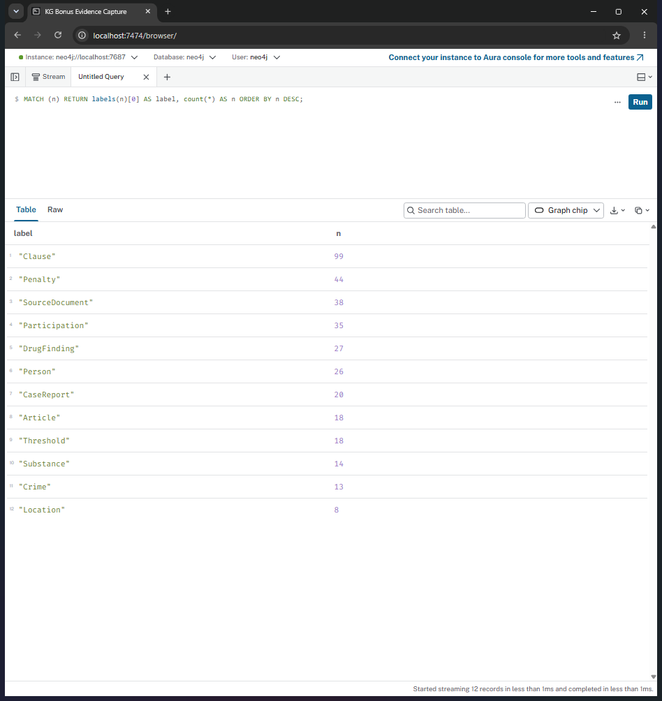
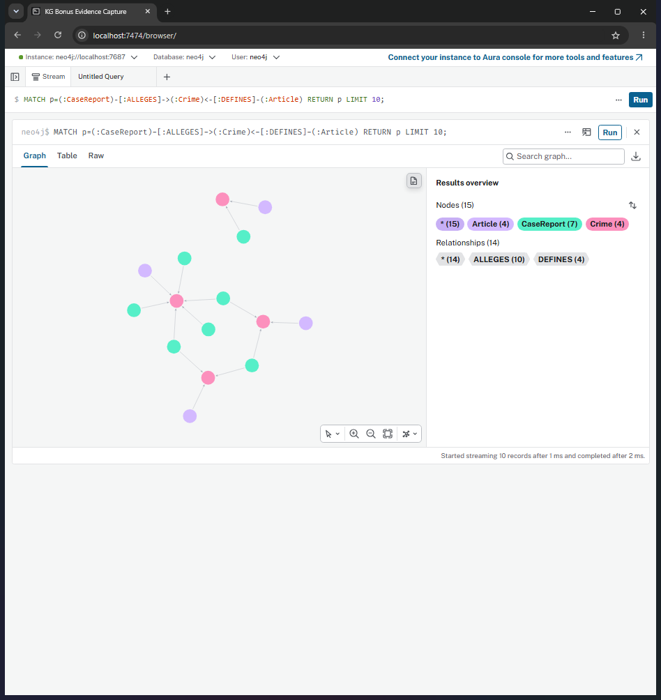
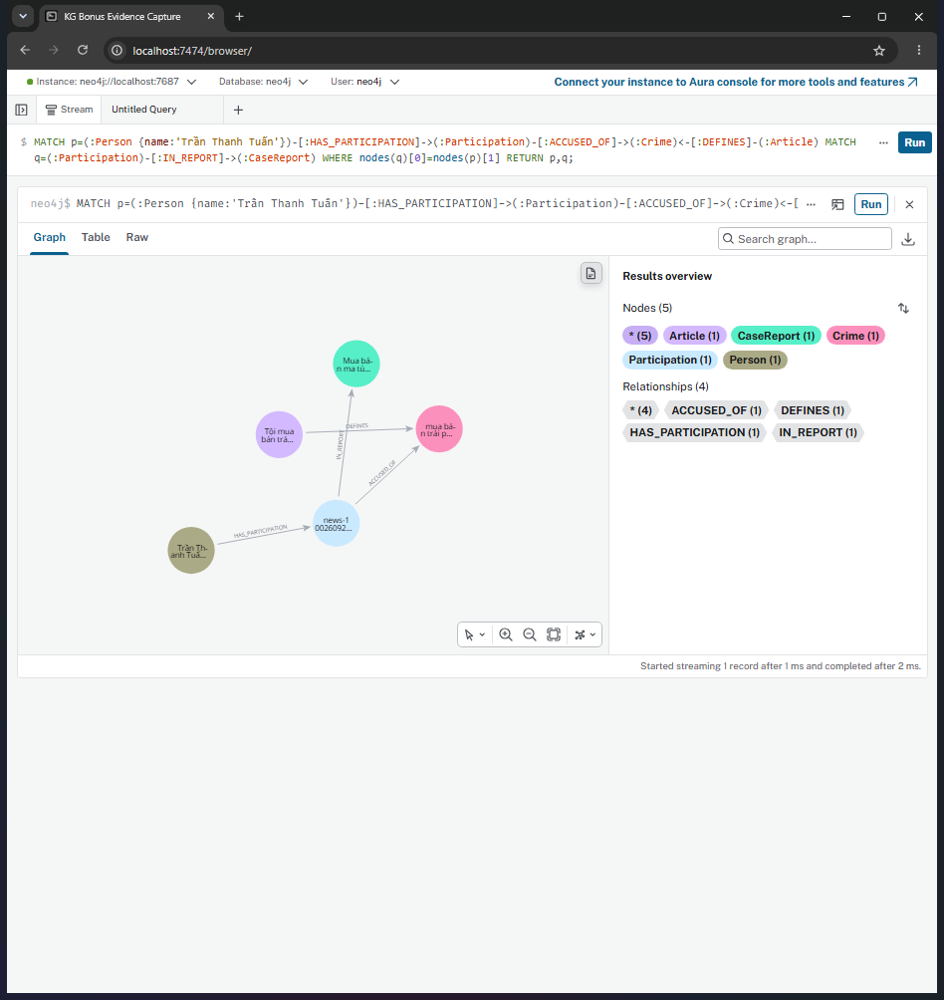

# Báo cáo Day 19 — Flat RAG vs GraphRAG, ontology bonus

**Họ tên:** Mai Văn Trung  **MSSV:** 2A202602513  **Ngày:** 05/10/2026

Corpus: 18 điều luật, 20 bài báo, 176 chunk; top_k=3, chunk_size=800. Chat và embedding đều qua OpenRouter với `openai/gpt-4o-mini` và `openai/text-embedding-3-small`. Giữ nguyên benchmark và 48 test gốc. Thiết kế mới: [ONTOLOGY.md](ONTOLOGY.md), **12 label, 15 loại cạnh**; graph cuối **360 node / 691 cạnh**. Các file benchmark đều sinh từ code với --judge, không sửa đáp án hay điểm.

Kết quả cuối: [ket_qua_benchmark_kg.txt](../ket_qua_benchmark_kg.txt). Baseline gợi ý: [ket_qua_benchmark_kg.hint.txt](../ket_qua_benchmark_kg.hint.txt). Bằng chứng trước/sau: [audit cũ](hint/audit_kg.json), [audit mới](audit_kg.json), [so sánh có hash](bonus_comparison.json).

## 1. Chi phí

Hai bảng chép nguyên từ benchmark cuối:

```text
== Indexing (one-off)
pipeline  calls    in_tok  out_tok       USD  seconds
flat        176     56072        0   0.00112    104.7
graph       196     94311     7655   0.01145    204.6

== Querying (mean per question)
pipeline  recall  judge   in_tok  out_tok       USD  seconds
flat        0.43   1.00      694       47   0.00013     2.43
graph       1.00   1.83     3172      103   0.00053     3.37
```

| Chỉ số | Flat | Graph bonus | Graph / Flat |
| --- | --- | --- | --- |
| Indexing USD | 0,00112 | 0,01145 | 10,22× |
| Indexing giây | 104,7 | 204,6 | 1,95× |
| Mỗi câu USD | 0,00013 | 0,00053 | 4,08× |
| Mỗi câu giây | 2,43 | 3,37 | 1,39× |
| Mỗi câu input token | 694 | 3172 | 4,57× |

Graph indexing bao gồm cùng vector index của Flat, cộng dựng KG: thêm 20 lần chat, 38239 input token, 7655 output token, khoảng **0,01033 USD / 99,9 giây**. Luật và ngưỡng trích bằng regex; chat dùng cho tin. Mỗi câu Graph thêm khoảng 2478 input token vì dữ kiện có nguồn và luật, đổi lại cung cấp đường nối mà Flat thiếu.

Giá ước tính trong src/llm.py đối chiếu ngày 05/10/2026: [OpenRouter GPT-4o-mini](https://openrouter.ai/openai/gpt-4o-mini) 0,15/0,60 USD mỗi triệu input/output token; [embedding](https://openrouter.ai/openai/text-embedding-3-small) 0,02 USD/triệu token. USD dựa trên token, không phải số dư tài khoản; chưa tính cache, phí nạp credit, phần cứng và Docker. LLM judge nằm ngoài chi phí pipeline; các lần check, thử nghiệm và lượt dừng không nằm trong bảng kết quả cuối. Benchmark tái sử dụng cùng vector index, không cộng hai indexing độc lập khi tính tiền thực chạy.

So với Flat, Graph vẫn tăng cả indexing và tiền hỏi, nên không có hòa vốn về USD thuần túy. Chi phí tăng thêm cho N câu xấp xỉ `0.01033 + N × 0.00040 USD`; lợi ích cần đánh giá bằng giá trị câu trả lời đủ căn cứ.

## 2. Từng câu hỏi

| Câu | Loại | Flat recall / judge | Graph bonus recall / judge | Thắng | Vì sao |
| --- | --- | --- | --- | --- | --- |
| Q1 | single-hop-law | 1,00 / 2 | 1,00 / 2 | Hòa chất lượng | Định nghĩa nằm trong một đoạn luật; KG bổ sung căn cứ. |
| Q2 | single-hop-news | 1,00 / 2 | 1,00 / 2 | Hòa chất lượng | Tên và án nằm trong một bài; Participation giữ án riêng theo người. |
| Q3 | cross-kb | 0,00 / 0 | 1,00 / 2 | Graph | Nối sentence trong tin với Điều 251 khoản 1. |
| Q4 | cross-kb | 0,00 / 0 | 1,00 / 2 | Graph | MAX_PENALTY lấy được khoản 4 Điều 255 dù không nhắc chất. |
| Q5 | cross-kb-multi-hop | 0,60 / 1 | 1,00 / 2 | Graph | DrugFinding và Threshold đối chiếu lượng có nguồn với ngưỡng của Điều 250. |
| Q6 | aggregation | 0,00 / 1 | 1,00 / 1 | Graph | Graph tăng keyword recall; judge hòa và đáp án vẫn tách người cùng nguồn thành nhiều vụ. |

Graph bonus có **5/6 câu judge=2**. Recall và judge là hai phép đo khác nhau: keyword recall không kiểm mức án/tội đúng; judge dựa trên gold và có thể chấm sai. Điểm không phải kiểm chứng độc lập về pháp luật hiện hành. Q1–Q2 nằm gọn một đoạn nên Flat đủ; Q3–Q5 cần nối tin với luật; Q6 cần bao phủ nhiều nguồn và phân biệt số báo cáo với số vụ.

## 3. Phân tích lỗi và bằng chứng sửa

### E2 — Khung cao nhất bị bỏ do lọc khoản theo chất (đã sửa)

**Hiện tượng:** Q4 ontology gợi ý trả tối đa 7 năm, dù Điều 255 khoản 4 có 20 năm hoặc chung thân.

**Bằng chứng trước:** nguyên văn Q4 Graph trong file .hint.txt:

> Giang hồ 'Hoàng Nato' bị bắt về hành vi tổ chức sử dụng trái phép chất ma túy. Hành vi này có thể bị phạt tù tối đa 7 năm theo Điều 255 Bộ luật Hình sự.

**Nguyên nhân:** lấy khoản 1 và khoản MENTIONS chất; khoản 4 Điều 255 không nhắc chất. LLM biến khung cơ bản thành tối đa. Ontology cũ không có quan hệ biểu diễn khung cao nhất.

**Sửa cụ thể:** thêm Penalty với life/death/số năm/severity, HAS_PENALTY và Article MAX_PENALTY, giữ Clause áp dụng. src/graph.py.context dùng đường này cho câu hỏi tối đa, không cần chất xuất hiện trong khoản. src/legal_evidence.py xếp khung từ chính văn bản corpus. Đánh đổi: tăng node/quan hệ và công dựng graph; tránh kéo hết khoản cho mọi câu.

Truy vấn sau:

```cypher
MATCH (a:Article {id:'Điều 255 BLHS'})-[:MAX_PENALTY]->(p:Penalty)<-[:HAS_PENALTY]-(cl:Clause) RETURN a.id AS article, cl.number AS number, p.text AS penalty, p.life AS life, p.death AS death;
```

```json
[
  {
    "article": "Điều 255 BLHS",
    "number": 4,
    "penalty": "phạt tù 20 năm hoặc tù chung thân",
    "life": true,
    "death": false
  }
]
```

**Bằng chứng sau:** nguyên văn Q4 Graph trong benchmark cuối:

> Giang hồ 'Hoàng Nato' (Dương Minh Tuấn) bị bắt về hành vi tổ chức sử dụng trái phép chất ma túy. Hành vi này có thể bị phạt tù tối đa 20 năm hoặc tù chung thân theo khoản 4 Điều 255 Bộ luật Hình sự.

### E3 — Teaser tạo một vụ Cái Quang Huy trong bài Lê Minh Thành (đã giảm)

**Hiện tượng:** hai Case dùng tên khác nhau mô tả Huy, một cái sinh từ đoạn bài liên quan ở cuối nguồn Lê Minh Thành. Đáp án Q6 cũ lặp vụ Huy.

**Bằng chứng trước:** Cypher và kết quả lưu trong audit gợi ý:

```cypher
MATCH (p:Person {name:'Cái Quang Huy'})-[r:INVOLVED_IN]->(k:Case) RETURN p.name AS person, k.name AS case_name, k.doc_id AS doc_id, r.charge AS charge, r.sentence AS sentence ORDER BY doc_id;
```

```json
[
  {
    "person": "Cái Quang Huy",
    "case_name": "Vụ vận chuyển ma túy từ Đức về Việt Nam",
    "doc_id": "news-100260917203001265",
    "charge": "vận chuyển trái phép chất ma túy",
    "sentence": ""
  },
  {
    "person": "Cái Quang Huy",
    "case_name": "Vụ vận chuyển ma túy của Cái Quang Huy",
    "doc_id": "news-100260918080821054",
    "charge": "vận chuyển trái phép chất ma túy",
    "sentence": ""
  }
]
```

**Nguyên nhân:** nguồn chưa phân biệt teaser với thân bài và khóa Case là tên LLM tự đặt. MERGE theo tên không giải quyết hai tên cùng một vụ, có thể ghi đè nguồn.

**Sửa cụ thể:** SourceDocument và CaseReport theo doc_id tách báo cáo khỏi mã vụ thật; Participation giữ tội/án theo nguồn. Quy tắc trong src/legal_evidence.py loại đoạn cuối khớp nguyên văn lead của bài khác trong cùng corpus; không dùng tên người hoặc gold cố định. src/graph.py trích vụ chính. Đánh đổi: chưa tự merge mọi báo cáo cùng vụ; teaser ngoài corpus/đổi chữ vẫn có thể còn. Giữ nhiều báo cáo có nguồn là chủ đích, không gọi số node là số vụ duy nhất.

Truy vấn sau và kết quả:

```cypher
MATCH (p:Person {name:'Cái Quang Huy'})-[:HAS_PARTICIPATION]->(i:Participation)-[:IN_REPORT]->(k:CaseReport) OPTIONAL MATCH (i)-[:ACCUSED_OF]->(c:Crime) RETURN p.name AS person, k.name AS case_name, k.doc_id AS doc_id, collect(c.name) AS charges, i.stage AS stage, i.sentence AS sentence ORDER BY doc_id;
```

```json
[
  {
    "person": "Cái Quang Huy",
    "case_name": "Cái Quang Huy và Nguyễn Tiến Đạt",
    "doc_id": "news-100260917203001265",
    "charges": [
      "vận chuyển trái phép chất ma túy"
    ],
    "stage": "truy nã",
    "sentence": ""
  }
]
```

### E6 — Lượng chưa đủ bằng chứng số hoặc đơn vị chưa hỗ trợ (còn giới hạn)

**Hiện tượng:** một số DrugFinding giữ amount nguyên văn nhưng không có mass_g dùng để so ngưỡng. Đây có thể là thiếu đơn vị hợp lệ như “5 viên”, hoặc quote LLM không khớp nguồn.

**Bằng chứng:** truy vấn sau; hiển thị tối đa 3 hàng, toàn bộ ở audit_kg.json:

```cypher
MATCH (f:DrugFinding) WHERE f.amount <> '' AND NOT f.quantity_verified RETURN f.doc_id AS doc_id, f.amount AS amount, f.qualifier AS qualifier, f.verified AS quote_verified, f.evidence AS evidence ORDER BY doc_id, amount;
```

```json
[
  {
    "doc_id": "news-100260918080821054",
    "amount": "5 viên",
    "qualifier": "unknown",
    "quote_verified": true,
    "evidence": "Cơ quan công an thu giữ một hộp vuông màu xanh chứa 5 viên nén màu trắng. Kết luận giám định xác định số viên nén này là ma túy MDMA."
  },
  {
    "doc_id": "news-100260920221957595",
    "amount": "hơn 1.000 đầu pod chill",
    "qualifier": "unknown",
    "quote_verified": true,
    "evidence": "Tang vật thu giữ gồm hơn 1.000 đầu pod chill chứa ma túy etomidate"
  },
  {
    "doc_id": "news-100260920221957595",
    "amount": "khoảng 100g",
    "qualifier": "approx",
    "quote_verified": false,
    "evidence": "Tang vật thu giữ... khoảng 100g ma túy tổng hợp các loại"
  }
]
```

**Nguyên nhân:** corpus chưa có khối lượng cho số viên/chỉ; quote được LLM trích có thể đổi câu chữ hoặc không chứng minh lượng. Kiểm quote/mass không kiểm entailment toàn bộ chủ thể. Xấp xỉ “gần/khoảng” cũng không đủ kết luận ngưỡng pháp lý, kể cả khi mass_g biểu diễn được giá trị ước lượng.

**Đề xuất:** giữ giá trị chưa biết, không điền số giả; bổ sung extraction schema/kiểm chủ thể và trích dẫn, kiểm lại nguồn khi LLM quote sai; chỉ đổi đơn vị có căn cứ. Regex tổng lượng đã bổ sung mẫu trách nhiệm trong nguồn, không tự cộng lượng thu giữ và tổng. Đánh đổi: thêm logic/kiểm toán, có thể tăng token nếu phải trích lại; chưa giải quyết đơn vị vật phẩm hay mọi cấu trúc văn bản.

### E4 — Recall/judge chưa chứng minh độ đúng

**Bằng chứng còn lại ở Q6 Graph bonus (recall=1,00, judge=1):** câu trả lời gọi “4 vụ việc”, nhưng mục Cái Quang Huy và mục Nguyễn Hữu Đức cùng dẫn `news-100260917203001265`. Câu trả lời không dẫn nguồn `news-100260924105118645` dù graph có báo cáo này trong mdma_cases; không thể kết luận đã liệt kê đúng mọi vụ duy nhất. Nguyên văn đáp án cuối:

> Có 4 vụ việc trong tin tức liên quan đến ma túy MDMA:
>
> 1. **Vụ Cái Quang Huy và Nguyễn Tiến Đạt**: Cái Quang Huy bị cáo buộc vận chuyển hơn 9,6kg MDMA và gần 4,3kg MDMA liên quan đến Nguyễn Tiến Đạt. (Báo cáo [news-100260917203001265])
>
> 2. **Vụ Lê Minh Thành**: Lê Minh Thành bị bắt quả tang khi mang theo 5 viên MDMA để bán. (Báo cáo [news-100260918080821054])
>
> 3. **Vụ Lê Văn Đông**: Lê Văn Đông bị phát hiện có 0,686g MDMA trong phòng chữa bệnh tại Viện Pháp y tâm thần. (Báo cáo [news-100260930085028036])
>
> 4. **Vụ Nguyễn Hữu Đức**: Mặc dù không bị truy tố do không đủ chứng cứ chứng minh đồng phạm, nhưng có liên quan đến việc vận chuyển hơn 5,3kg MDMA. (Báo cáo [news-100260917203001265])
>
> Các vụ việc này đều có liên quan đến chất ma túy MDMA và được nêu rõ trong các báo cáo nguồn.

Q4 gợi ý recall=0,67 dù sai tối đa; Q6 Flat recall=0 nhưng judge=1 vì tên rút gọn. Điểm judge có thể khác mức bao phủ nguồn thực tế, nhất là gold Q6 gộp vụ viện trong khi nhiều bài cùng nói về viện/Sầm Sơn. Nguyên nhân là so chuỗi và LLM judge dựa trên gold. Đề xuất chấm theo trường/nguồn/tập vụ có định danh và rà soát gold, đổi lại tốn công gán nhãn. Giữ nguyên benchmark gốc theo quy định.

## 4. Kết luận

Graph bonus đạt recall trung bình **1,00**, judge **1,83**, so với Flat **0,43/1,00**; chi phí hỏi **4,08×**, input token **4,57×**. Nên dùng KG khi cần nối người/tội trong tin với điều/khoản/ngưỡng hoặc tổng hợp nhiều nguồn. Flat đủ cho Q1–Q2 single-hop. Phần so sánh bonus dưới cho thấy tác động thực của thiết kế.

KG vẫn cần kiểm dữ liệu: CaseReport không là mã vụ thật, tên người có thể trùng, quote/subject có thể trích sai, ngưỡng chỉ áp dụng phạm vi hỗ trợ. Một lần chạy và sáu câu chưa chứng minh độ ổn định hay hiệu quả ở corpus lớn. Mọi suy luận luật chỉ dựa trên phiên bản corpus lab.

## 5. Tự kiểm

```text
$ .venv/Scripts/python.exe -m pytest tests/ -q
..........................................................               [100%]
58 passed in 0.08s

$ .venv/Scripts/python.exe -u bench_kg.py --check
[OK] Dữ liệu: 18 điều luật, 20 bài báo
[OK] KG-1 link_entity
[OK] Neo4j kết nối được
[provider] chat = openrouter:openai/gpt-4o-mini | embedding = openrouter:openai/text-embedding-3-small
[OK] KG-2 build_graph: 231 node / 499 cạnh, đường xuyên 2 KB dài 2 cạnh
[OK] KG-3 context: 3 dữ kiện, có Điều 251
[OK] KG-4 GraphRAGAgent.answer
[OK] Chi phí check: 1 lần gọi LLM, $0.00082. Graph nhỏ (luật + 1 bài) vẫn còn trong Neo4j để bạn xem; chạy --judge để dựng graph đầy đủ.
```

58 test gồm **48 test gốc không sửa** và **10 test bonus**; check dựng luật + một bài, khác graph đầy đủ của benchmark. Check chạy trước benchmark; không chạy lại sau để tránh thay graph đầy đủ bằng graph nhỏ.

Graph cuối: Clause=99, Penalty=44, SourceDocument=38, Participation=35, DrugFinding=27, Person=26, CaseReport=20, Article=18, Threshold=18, Substance=14, Crime=13, Location=8; tổng 360. Quan hệ: MENTIONS=169, FOR_SUBSTANCE=108, HAS_CLAUSE=99, HAS_PENALTY=44, DESCRIBES=38, HAS_PARTICIPATION=35, IN_REPORT=35, ACCUSED_OF=27, HAS_FINDING=27, OF_SUBSTANCE=27, LOCATED_IN=20, HAS_THRESHOLD=18, ALLEGES=18, MAX_PENALTY=13, DEFINES=13; tổng 691. Có 18 đường CaseReport → Crime ← Article. Các label/cạnh khớp ONTOLOGY.md.

Ba ảnh chụp nguyên cửa sổ Chrome trên graph bonus, không dùng ảnh mẫu, không cắt/chỉnh ảnh. Chạy :clear trước từng truy vấn; thu sidebar/zoom trình duyệt để thấy đủ 12 label. Chọn **Trần Thanh Tuấn**, tội trên Participation riêng, khác người mẫu Lê Minh Thành.







## 6. Bonus +15 — so sánh ontology trước/sau

| Chỉ số GraphRAG | Gợi ý | Bonus |
| --- | --- | --- |
| Node / cạnh | 200 / 380 | 360 / 691 |
| Indexing USD | 0,00929 | 0,01145 |
| Indexing giây | 186,4 | 204,6 |
| Recall trung bình | 0,89 | 1,00 |
| Judge trung bình | 1,67 | 1,83 |
| Input token/câu | 4426 | 3172 |
| USD/câu | 0,00071 | 0,00053 |
| Giây/câu | 3,18 | 3,37 |

| Câu | Gợi ý recall / judge | Bonus recall / judge |
| --- | --- | --- |
| Q1 | 1,00 / 2 | 1,00 / 2 |
| Q2 | 1,00 / 2 | 1,00 / 2 |
| Q3 | 1,00 / 2 | 1,00 / 2 |
| Q4 | 0,67 / 1 | 1,00 / 2 |
| Q5 | 1,00 / 2 | 1,00 / 2 |
| Q6 | 0,67 / 1 | 1,00 / 1 |

Khác biệt có chủ đích và vấn đề giải quyết ghi đủ ở ONTOLOGY.md mục 7: nguồn/báo cáo, Participation theo giai đoạn/chủ thể, DrugFinding + Threshold, Penalty + MAX_PENALTY. Q4 là competency question pipeline gợi ý trả sai và pipeline mới có đường lấy đúng khung tối đa. Q5 bổ sung đối chiếu lượng có trích nguồn bằng Cypher, không chỉ nhờ LLM đọc số.

```cypher
MATCH (k:CaseReport)-[:HAS_FINDING]->(f:DrugFinding)-[:OF_SUBSTANCE]->(s:Substance {name:'MDMA'})<-[:FOR_SUBSTANCE]-(t:Threshold)<-[:HAS_THRESHOLD]-(cl:Clause)<-[:HAS_CLAUSE]-(a:Article {id:'Điều 250 BLHS'}) WHERE f.subject='Cái Quang Huy' AND f.quantity_verified=true AND f.qualifier IN ['eq','gt'] AND f.mass_g>=t.min_g AND (t.max_g IS NULL OR (f.qualifier='eq' AND f.mass_g<t.max_g)) RETURN k.doc_id AS doc_id, f.amount AS raw_amount, f.mass_g AS mass_g, f.qualifier AS qualifier, cl.number AS number, t.point AS point, t.min_g AS min_g, t.max_g AS max_g;
```

```json
[
  {
    "doc_id": "news-100260917203001265",
    "raw_amount": "hơn 9,6kg",
    "mass_g": 9600.0,
    "qualifier": "gt",
    "number": 4,
    "point": "b",
    "min_g": 100.0,
    "max_g": null
  }
]
```

Điểm hòa vốn giữa **Graph bonus và Graph gợi ý**: Khoảng **12 câu** để tiết kiệm tiền hỏi bù indexing tăng thêm: 0,00216 / 0,00018; chỉ tính USD đã làm tròn, cùng kiểu tải câu hỏi. Không phải hòa vốn với Flat. Các phép tính dùng bảng đã làm tròn.

Baseline .hint.txt và src/hint_graph.py được giữ byte-for-byte, có SHA-256 trong bonus_comparison.json. Cùng corpus/model/provider/top_k/chunk_size; đây là so sánh hai pipeline hoàn chỉnh, có cả thay đổi extraction, teaser, truy vấn và prompt. Không kết luận mọi mức tăng do riêng cấu trúc ontology; không có nhiều lần đo để loại nhiễu LLM/mạng.

Tái lập (mỗi benchmark xóa/dựng graph):

```powershell
$env:PYTHONIOENCODING='utf-8'
$env:LAB_SOLUTION_PACKAGE='src_hint'
.venv/Scripts/python.exe bench_kg.py --judge --out ket_qua_benchmark_kg.hint.rerun.txt
Remove-Item Env:LAB_SOLUTION_PACKAGE
.venv/Scripts/python.exe -m pytest tests/ -q
.venv/Scripts/python.exe bench_kg.py --check
.venv/Scripts/python.exe bench_kg.py --judge
.venv/Scripts/python.exe scripts/audit_kg.py
.venv/Scripts/python.exe scripts/capture_neo4j.py
.venv/Scripts/python.exe scripts/compare_bonus.py
```

Muốn report tái lập khớp lần mới, cập nhật log test/check; không sửa tay file benchmark. Chụp ảnh cần Windows/Chrome và requirements-browser.txt.

## Vấn đề gặp phải và giới hạn

- Lần thử đầu của bonus phát hiện LLM bỏ tổng lượng quy trách nhiệm; đã bổ sung regex lấy tổng có chủ thể duy nhất và ranh giới câu, kiểm bằng test. Bảng chính chỉ phản ánh code cuối, không trộn lượt thử.
- Một số CaseReport có thể thiếu tội hoặc thông tin vì bài không nêu tội trong corpus, ngoài chương luật hoặc extraction sai; xem broken_bridges. Không tự tạo căn cứ pháp lý không có trong nguồn.
- API key/venv được gitignore; không đưa key vào code/báo cáo. Bài làm được commit cục bộ; **chưa push, chưa nộp link**. Neo4j vẫn chạy để xem graph; có thể tắt khi không dùng.
