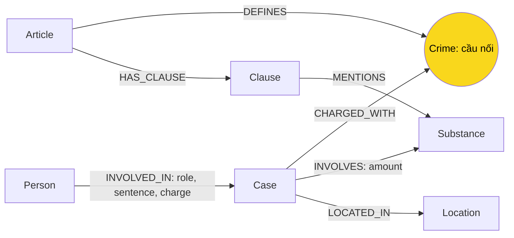

# Thiết kế Ontology — Day 19

**Họ tên:** Mai Văn Trung  **MSSV:** 2A202602513

- [x] Dùng ontology gợi ý, chỉnh nhỏ chuẩn hóa và truy xuất.
- [ ] Tự thiết kế (không xin bonus).

## 1. Sơ đồ

## 2. Entity types

| Label | Ý nghĩa | Khóa MERGE | Properties | KB | Trích xuất |
| --- | --- | --- | --- | --- | --- |
| Article | Một điều luật trong corpus | id (ví dụ Điều 251 BLHS) | title, law, doc_id | Luật | Metadata + regex |
| Clause | Một khoản của điều | id gồm điều + số khoản | number, penalty, text, doc_id | Luật | Regex đầu dòng số thứ tự; bỏ chú thích [n] |
| Crime | Tội danh chuẩn, cầu nối | name | name | Cả hai | Tiêu đề luật; LLM chọn danh sách chuẩn |
| Case | Vụ việc được bài báo mô tả | name | summary, date, doc_id, source_title | Tin | LLM JSON |
| Substance | Chất hoặc nhóm chất nêu đích danh | name | name | Cả hai | Regex ranh giới từ trong luật; LLM trong tin |
| Person | Người liên quan vụ việc | name | aliases, doc_id (nguồn đầu tiên) | Tin | LLM |
| Location | Địa điểm tỉnh/thành phố | name | name | Tin | LLM |

Article, Clause và Case mang doc_id; Person giữ nguồn đầu tiên khi tạo. Crime, Substance, Location là danh mục dùng chung nên không gán một doc_id độc quyền. Nguồn tra qua Case hoặc Article/Clause. Person cùng tên được MERGE, có nguy cơ gộp nhầm người. Case cùng tên được MERGE và ghi đè nguồn, chưa có cơ chế hợp nhất vụ việc giữa nhiều bài đáng tin cậy.

## 3. Relationships

| Type | Từ → Đến | Properties | Ý nghĩa |
| --- | --- | --- | --- |
| DEFINES | Article → Crime | Không | Điều định nghĩa tội |
| HAS_CLAUSE | Article → Clause | Không | Điều có khoản |
| MENTIONS | Clause → Substance | Không | Khoản nhắc chất, chưa khẳng định áp dụng cho vụ |
| CHARGED_WITH | Case → Crime | Không | Vụ liên quan tội đã chuẩn hóa |
| INVOLVES | Case → Substance | amount (chuỗi) | Chất và lượng báo nêu |
| LOCATED_IN | Case → Location | Không | Địa điểm vụ |
| INVOLVED_IN | Person → Case | role, sentence, charge | Vai trò, án và tội riêng của người |

Các khóa có constraint UNIQUE. Dữ liệu nhận bằng tham số, không ghép tên người vào Cypher động.

## 4. Node cầu nối giữa hai KB

Crime là cầu chính: Person → Case → Crime ← Article. Substance là cầu phụ chọn khoản và tổng hợp vụ MDMA.

Luật dùng normalize_crime bỏ tiền tố “Tội”, chữ hoa và khoảng trắng thừa. Prompt tin nhận nguyên danh sách tội từ luật. link_entity so tên chuẩn hóa trước, sau đó difflib cutoff 0,8; trả cách viết gốc trong danh mục. Tên không khớp trả None; không tạo tội ngoài luật. Chất chuẩn hóa về danh mục, chất mới như etomidate giữ tên.

Cầu có thể gãy nếu LLM bỏ tội danh, bài chỉ nói hành vi chung hoặc tội thuộc chương không có trong corpus. Kiểm tra Case không có CHARGED_WITH rồi đối chiếu nguồn. Không suy diễn tội từ chữ “ma túy”. JSON hỏng làm dừng dựng graph với doc_id trong lỗi, thay vì âm thầm coi như không có vụ.

## 5. Competency questions

| Câu | Đường đi và cách lấy dữ kiện | Trả lời được? |
| --- | --- | --- |
| Q1 tiền chất | Article PCMT → HAS_CLAUSE → Clause, đọc định nghĩa | Có; không cần Crime |
| Q2 án tử hình vụ 36 kg | Case ← INVOLVED_IN — Person; đọc sentence và tin top-k | Có nếu trích án từng người đúng |
| Q3 Lê Minh Thành | Person → Case → Crime ← Article → Clause số 1; sentence ở INVOLVED_IN | Có: nối tin với khung cơ bản |
| Q4 Hoàng Nato | aliases Person → Case → Crime ← Article → Clause | Một phần: lọc khoản theo chất có thể bỏ khung cao nhất Điều 255 |
| Q5 Cái Quang Huy, MDMA | Person → Case → INVOLVES → Substance; Case → Crime ← Article → Clause → MENTIONS → Substance | Có lượng và văn bản ngưỡng; LLM còn phải tự đổi đơn vị và đọc khoản |
| Q6 các vụ MDMA | Substance MDMA ← INVOLVES — Case ← INVOLVED_IN — Person | Có đường lấy mọi vụ; còn chịu max_facts và lỗi trích/tổng hợp |

Seeds theo doc_id của vector top-k, tên hoặc aliases trong câu hỏi. Từ seeds lấy Case kề một bước, đi qua Crime đến luật. Giữ khoản 1 và khoản nhắc chất của vụ. Điều nêu trực tiếp hoặc tìm bởi vector bổ sung khoản 1 và khoản nhắc chất hỏi; PCMT lấy mọi khoản vì chứa định nghĩa. Tóm tắt và luật đứng trước các cạnh lân cận; loại trùng và giới hạn 60 dữ kiện. Đây là giới hạn số dữ kiện, không phải token.

## 6. Quyết định thiết kế và đánh đổi

1. Giữ Crime làm cầu thay vì nối Case thẳng Article: danh mục luật hỗ trợ nhiều cách viết tin, nhưng tội ngoài corpus không có căn cứ để nối. Fuzzy có thể ghép nhầm tội gần tên, cần kiểm toán khi dùng thật.
2. Tách Clause thay vì lưu nguyên điều trên Article: có thể chọn khung cơ bản và khoản có chất liên quan để giảm prompt. Đổi lại dễ bỏ khoản cao nhất không nhắc chất; Q4 kiểm tra hạn chế này.
3. Giữ amount và sentence nguyên văn thay vì node Threshold/Sentence có đơn vị số: giữ “hơn”, “gần”, tháng/năm. Đổi lại LLM phải đổi đơn vị; MENTIONS không đủ khẳng định áp dụng khoản.
4. Khóa Case/Person theo tên thay vì mã hồ sơ và danh tính: phù hợp lab nhỏ và ontology gợi ý, nhưng LLM đặt tên không ổn định và người trùng tên là hạn chế. Ranh giới từ trong find_substances tránh tự nhận Amphetamine chỉ vì có Methamphetamine.

## 7. So với ontology gợi ý

Không xin bonus. Giữ nguyên 7 label, 7 loại cạnh và đường nối. Chỉnh nhỏ gồm JSON mode, báo lỗi JSON, doc_id cho Person, chuẩn hóa chất, ranh giới từ và ưu tiên luật trước giới hạn context. Không có benchmark ontology khác để tuyên bố cải thiện thiết kế.

## 8. Hạn chế còn lại

- Corpus cố định BLHS 2015 sửa đổi 2017 và PCMT 2021; chỉ mô tả corpus lab, không xác minh luật hiện hành.
- Không tách giai đoạn bắt giữ/truy tố/sơ thẩm/phúc thẩm; role/sentence không đủ lưu lịch sử thay đổi.
- Không có danh tính pháp lý người trùng tên, mã vụ hoặc liên kết nhiều nguồn.
- LLM có thể lấy cả đoạn giới thiệu bài liên quan cuối bài, tạo vụ dư/sai nguồn.
- Lọc khoản theo chất dễ thiếu mức tối đa và tình tiết tăng nặng.
- amount chưa chuẩn hóa đơn vị/ngưỡng; không có suy luận pháp lý tất định.
- Keyword recall và LLM judge đều có sai số; phải đọc đáp án và truy vấn graph.
