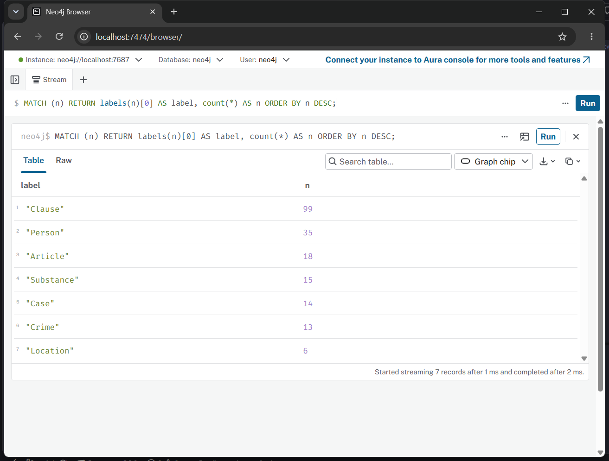
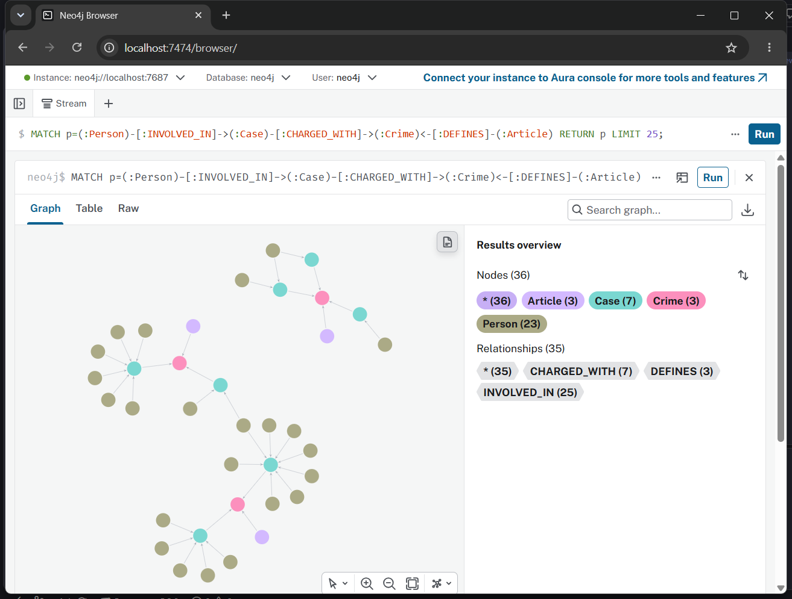
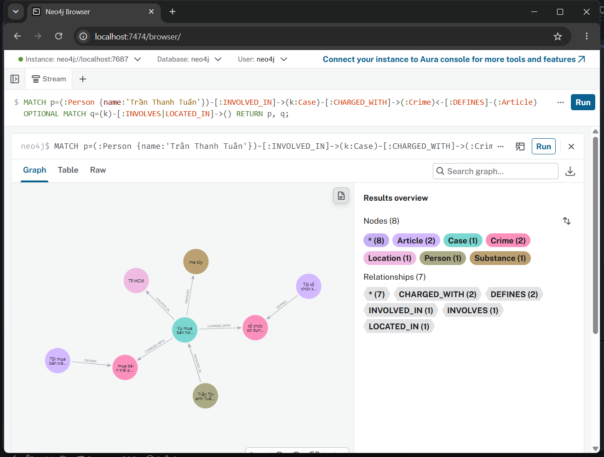

# Báo cáo Day 19 — Flat RAG vs GraphRAG

**Họ tên:** Mai Văn Trung  **MSSV:** 2A202602513  **Ngày:** 05/10/2026

Chạy trên corpus có sẵn: 18 điều luật, 20 bài báo, 176 chunk; top_k=3, chunk_size=800. Cả hai pipeline dùng chat `openrouter:openai/gpt-4o-mini` và embedding `openrouter:openai/text-embedding-3-small`. Benchmark gọi API thật, có LLM judge; giữ nguyên `bench_kg.py` và các test gốc. Graph cuối có **200 node, 380 cạnh**. Thiết kế: [ONTOLOGY.md](ONTOLOGY.md). Số liệu nguồn: [ket_qua_benchmark_kg.txt](../../ket_qua_benchmark_kg.hint.txt). Bằng chứng truy vấn: [audit_kg.json](audit_kg.json).

## 1. Chi phí

Hai bảng dưới được chép nguyên từ file benchmark, không sửa số liệu:

```text
== Indexing (one-off)
pipeline  calls    in_tok  out_tok       USD  seconds
flat        176     56072        0   0.00112    106.7
graph       196     91958     4647   0.00929    186.4

== Querying (mean per question)
pipeline  recall  judge   in_tok  out_tok       USD  seconds
flat        0.43   1.00      694       47   0.00013     2.38
graph       0.89   1.67     4426       80   0.00071     3.18
```

| Chỉ số | Flat | Graph | Graph / Flat |
| --- | --- | --- | --- |
| Indexing USD | 0,00112 | 0,00929 | 8,29× |
| Indexing giây | 106,7 | 186,4 | 1,75× |
| Mỗi câu: USD | 0,00013 | 0,00071 | 5,46× |
| Mỗi câu: giây | 2,38 | 3,18 | 1,34× |
| Mỗi câu: in_tok | 694 | 4426 | 6,38× |

Các tỉ lệ tính từ số đã làm tròn trong file benchmark, không phải số kế toán chính xác của tài khoản. Graph indexing bao gồm cùng vector index của Flat cộng dựng KG: thêm **20 lần gọi chat**, 35886 input token, 4647 output token, khoảng **0,00817 USD và 79,7 giây**. Luật trích bằng regex nên không tốn chat; chi phí tăng đến từ trích 20 bài tin. Chi phí hỏi tăng vì thêm dữ kiện graph, đặc biệt văn bản nguyên khoản luật; trung bình thêm 3732 input token mỗi câu.

Giá tham chiếu được đối chiếu ngày 05/10/2026: [OpenRouter GPT-4o-mini](https://openrouter.ai/openai/gpt-4o-mini) 0,15 USD/triệu input và 0,60 USD/triệu output token; [Text Embedding 3 Small](https://openrouter.ai/openai/text-embedding-3-small) 0,02 USD/triệu token. Bảng trong `src/llm.py` khớp các mức này. USD là ước tính theo token, chưa tính khác biệt cache, phí nạp credit, Docker và phần cứng. Embedding dùng [endpoint OpenRouter](https://openrouter.ai/docs/api/api-reference/embeddings/submit-an-embedding-request) qua SDK OpenAI tương thích.

12 lần LLM judge nằm ngoài chi phí hai pipeline theo cách đo của script. Benchmark dùng chung vector index nên khi ước tính tiền thực chi không cộng cả hai indexing độc lập: khoảng 0,00929 + 6 × (0,00013 + 0,00071) = **0,01433 USD**, chưa gồm judge và lần tự kiểm riêng. Lần `--check` dùng khoảng 0,00064 USD.

**Điểm hòa vốn:** nếu chỉ xét USD, không có số câu hỏi dương giúp Graph rẻ hơn trong lần đo này: phần tăng thêm xấp xỉ `0,00817 + N × 0,00058 USD`. KG đáng cân nhắc khi giá trị câu trả lời đầy đủ hơn bù được chi phí. Chi phí dựng thêm phân bổ cho 1000 câu là khoảng 0,00000817 USD/câu, nhưng chi phí prompt graph vẫn còn. Không thể dùng 6 câu để kết luận hiệu quả tài chính trong môi trường thực.

## 2. Từng câu hỏi

| Câu | Loại | Flat recall / judge | Graph recall / judge | Thắng | Vì sao |
| --- | --- | --- | --- | --- | --- |
| Q1 | single-hop-law | 1,00 / 2 | 1,00 / 2 | Hòa về chất lượng; Flat rẻ hơn | Định nghĩa tiền chất nằm trong một đoạn luật; Graph thêm dẫn Điều 2 khoản 4 |
| Q2 | single-hop-news | 1,00 / 2 | 1,00 / 2 | Hòa về chất lượng; Flat rẻ hơn | Một đoạn tin đã có cả Trần Thanh Tuấn và Trần Minh Tâm cùng án tử hình |
| Q3 | cross-kb | 0,00 / 0 | 1,00 / 2 | Graph | Nối án 36 tháng trong tin với Điều 251 khoản 1, khung 02–07 năm |
| Q4 | cross-kb | 0,00 / 0 | 0,67 / 1 | Graph trả được một phần | Có hành vi và Điều 255 nhưng sai mức tối đa vì thiếu khoản 4 |
| Q5 | cross-kb-multi-hop | 0,60 / 1 | 1,00 / 2 | Graph | Nối MDMA 9,6 kg với Điều 250 khoản 4, thay vì gọi mơ hồ “khoản b)” |
| Q6 | aggregation | 0,00 / 1 | 0,67 / 1 | Graph theo recall; hòa judge | Graph nêu đủ họ tên hơn nhưng lặp vụ Cái Quang Huy và thiếu vụ tại viện |

Riêng Q3–Q5, recall trung bình Flat **0,20**, Graph **0,89**; judge lần lượt **0,33** và **1,67**. Toàn bộ 6 câu, số câu được judge=2 là Flat **2/6**, Graph **4/6**. Đây là điểm chấm theo gold của lab, không phải kiểm chứng độc lập về pháp luật hiện hành.

Quy luật quan sát: câu single-hop không được lợi về điểm từ KG; câu cần nối tin với luật được lợi rõ. Câu tổng hợp chưa được giải quyết chỉ bằng việc thêm graph, vì chất lượng định danh vụ và khâu tổng hợp vẫn có thể sai.

## 3. Phân tích lỗi

### E2 — Lọc khoản làm mất khung hình phạt cao nhất

**Hiện tượng:** GraphRAG Q4 có đúng tội và Điều 255 nhưng khẳng định mức tối đa là 7 năm.

**Bằng chứng:** nguyên văn Q4 Graph từ file benchmark:

> Giang hồ 'Hoàng Nato' bị bắt về hành vi tổ chức sử dụng trái phép chất ma túy. Hành vi này có thể bị phạt tù tối đa 7 năm theo Điều 255 Bộ luật Hình sự.

Kiểm tra luật trong graph:

```cypher
MATCH (:Article {id:'Điều 255 BLHS'})-[:HAS_CLAUSE]->(cl:Clause)
RETURN cl.number AS number, cl.penalty AS penalty ORDER BY number;
```

Các giá trị `penalty` quan trọng trong `audit_kg.json`:

```text
1: phạt tù từ 02 năm đến 07 năm
2: phạt tù từ 07 năm đến 15 năm
3: phạt tù từ 15 năm đến 20 năm
4: phạt tù 20 năm hoặc tù chung thân
```

Truy vấn vụ liên quan:

```cypher
MATCH (p:Person {name:'Dương Minh Tuấn'})-[:INVOLVED_IN]->(k:Case)
OPTIONAL MATCH (k)-[:INVOLVES]->(s:Substance)
RETURN k.doc_id, collect(DISTINCT s.name) AS substances;
```

Vụ nguồn `news-100260925144412498` có chất `etomidate`. Chạy `context` riêng trên câu Q4 và nguồn này đã lưu ở `audit_kg.json/q4_context`; dữ kiện Điều 255 chỉ có **khoản 1**, trong khi graph lưu đầy đủ khoản 4. Gold của lab yêu cầu khung tối đa **20 năm hoặc tù chung thân**.

**Nguyên nhân:** KG-3 trong `src/graph.py` giữ khoản 1 hoặc khoản MENTIONS chất của vụ. Các khoản 2–4 Điều 255 nói về tình tiết, hậu quả và độ tuổi, không nêu tên chất, nên bị bỏ. Không phải lỗi regex thiếu khoản hay cầu Crime bị gãy. LLM còn biến khung cơ bản thành mức tối đa; prompt không phát hiện thiếu căn cứ cho từ “tối đa”.

**Đề xuất sửa:** trong `Neo4jGraph.context`, với câu hỏi khung cao nhất/tối đa, lấy toàn bộ các khoản có hình phạt của Article liên quan thay vì lọc theo Substance; giữ điều kiện áp dụng cùng khung. Thêm chỉ dẫn trong GRAPH_PROMPT không gọi khung cơ bản là mức tối đa. Đánh đổi: tăng input token và có thể thêm độ trễ; cần benchmark lại để đo. Đây là đề xuất chưa áp dụng vào kết quả đang báo cáo.

### E3 — Một vụ thực tế thành hai node Case

**Hiện tượng:** vụ vận chuyển của Cái Quang Huy xuất hiện hai lần trong graph và trong đáp án Q6.

**Bằng chứng:** truy vấn từ `audit_kg.json/huy_provenance`:

```cypher
MATCH (p:Person {name:'Cái Quang Huy'})-[r:INVOLVED_IN]->(k:Case)
RETURN p.name AS person, k.name AS case_name, k.doc_id AS doc_id,
       r.charge AS charge, r.sentence AS sentence ORDER BY doc_id;
```

```text
Cái Quang Huy | Vụ vận chuyển ma túy từ Đức về Việt Nam
  | news-100260917203001265 | vận chuyển trái phép chất ma túy | sentence=''
Cái Quang Huy | Vụ vận chuyển ma túy của Cái Quang Huy
  | news-100260918080821054 | vận chuyển trái phép chất ma túy | sentence=''
```

Cạnh INVOLVES ở hai Case đều có MDMA với lượng `9.6kg` / `9,6kg`. Trong file nguồn thứ hai, phần chính nói về Lê Minh Thành, nhưng đoạn cuối giới thiệu bài liên quan về Cái Quang Huy. Prompt đọc cả đoạn cuối nên trích ra một vụ phụ với tên khác.

Nguyên văn Q6 Graph có hai mục:

> 1. **Vụ vận chuyển ma túy từ Đức về Việt Nam**: Cái Quang Huy bị cáo buộc vận chuyển hơn 9,6kg MDMA.
>
> 3. **Vụ vận chuyển ma túy của Cái Quang Huy**: Cái Quang Huy cũng bị cáo buộc vận chuyển hơn 9,6kg MDMA.

**Nguyên nhân:** lớp crawl chưa phân biệt thân bài với teaser bài liên quan; lớp extraction tạo cả vụ phụ. Ontology dùng tên tự do do LLM đặt làm khóa Case, nên UNIQUE và MERGE chỉ ngăn tên giống hệt, không ngăn hai tên cùng mô tả một vụ. Chuẩn hóa dấu phẩy ở lượng cũng chưa được mô hình hóa.

**Đề xuất sửa:** giới hạn extraction vào vụ chính theo tiêu đề, phân loại teaser ở `scripts/crawl_drug_corpus.py`; trong graph dùng mã vụ xác minh hoặc cơ chế ứng viên SAME_CASE dựa trên người, thời gian, tuyến đường và lượng. Chỉ merge sau khi đủ bằng chứng và giữ danh sách nguồn. Đánh đổi: thêm code, có thể thêm một lần LLM xác minh mỗi cặp; gộp theo người đơn thuần sẽ gộp nhầm các vụ khác nhau. Các đề xuất này chưa áp dụng.

### E5 — Đáp án tổng hợp thiếu một vụ có trong graph

**Hiện tượng:** Q6 Graph không nêu “Vụ án tại Viện Pháp y tâm thần Trung ương”, dù tồn tại cạnh MDMA. Judge chỉ đạt 1 và recall 0,67.

**Bằng chứng:**

```cypher
MATCH (k:Case)-[r:INVOLVES]->(:Substance {name:'MDMA'})
RETURN k.name, k.doc_id, r.amount ORDER BY k.doc_id;
```

Kết quả tương ứng `audit_kg.json/mdma_cases`:

```text
Vụ vận chuyển ma túy từ Đức về Việt Nam | news-100260917203001265 | 9.6kg
Vụ góp tiền mua ma túy tại Hà Nội | news-100260918080821054 | 5 viên
Vụ vận chuyển ma túy của Cái Quang Huy | news-100260918080821054 | 9,6kg
Vụ án tại Viện Pháp y tâm thần Trung ương | news-100260924105118645 | ''
Vụ tổ chức sử dụng ma túy tại Sầm Sơn | news-100260930085028036 | 0,686g
```

Q6 Graph trong benchmark chỉ liệt kê các dòng 1, 2, 3 và 5, bỏ dòng 4. Đoạn nguồn `news-100260924105118645` có câu về thu giữ MDMA, ketamine, methamphetamine và cần sa tại phòng vợ chồng Mai Anh trong viện. Truy xuất độc lập từ node MDMA, không dùng vector, lưu trong `q6_context_without_vector` của audit để kiểm tra đường graph. Đây không phải bản chụp prompt của lần benchmark.

**Nguyên nhân:** có bằng chứng graph lưu được vụ nhưng câu trả lời không bao phủ mọi Case. Chưa lưu prompt nguyên văn lúc benchmark nên chưa thể tách chắc chắn ảnh hưởng của max_facts và việc LLM bỏ sót; không kết luận chỉ một tầng gây lỗi. Prompt chung cũng không yêu cầu đối chiếu số vụ tìm được với số vụ liệt kê, và E3 làm danh sách nhiễu.

**Đề xuất sửa:** thêm nhánh aggregation trong `context`, lấy danh sách Case DISTINCT qua chất hỏi, không kéo toàn bộ khoản luật cho câu chỉ hỏi các vụ; yêu cầu LLM bao phủ từng mã vụ hoặc trả danh sách tất định từ Cypher trước phần diễn giải. Lưu prompt phục vụ audit. Đánh đổi: thêm logic loại câu hỏi; DISTINCT theo node không tự sửa Case trùng, vẫn phải giải quyết E3.

### E4 — Keyword recall không tương đương độ đúng

**Hiện tượng và bằng chứng:** Q4 Graph vẫn có recall 0,67 nhờ chứa “tổ chức sử dụng” và “Điều 255”, dù số tối đa 7 năm sai. Q6 Flat recall=0 nhưng judge=1: câu trả lời dùng tên rút gọn “Thành”, “Đông”, không chứa họ tên đầy đủ hoặc cụm “Pháp y tâm thần” trong must_include. Q6 Graph có thể tăng điểm nhờ đủ tên dù vẫn lặp vụ và thiếu vụ.

**Nguyên nhân:** `keyword_recall` kiểm chuỗi con, không kiểm tính đúng của số liệu, quan hệ hay danh sách đầy đủ. Judge linh hoạt hơn nhưng cùng model và dựa vào gold; gold Q6 có ba nhóm vụ trong khi corpus còn bài Sầm Sơn, nên không xem judge là chân lý.

**Đề xuất sửa:** bổ sung chấm các trường câu trả lời (người, tội, điều, khoản, mức án), tập mã vụ duy nhất và kiểm chứng nguồn; rà soát gold Q6 theo phạm vi gộp vụ. Đánh đổi: tốn công chuẩn bị nhãn và có thể tăng chi phí judge. Giữ nguyên benchmark gốc trong bài này theo quy định, chỉ ghi rõ giới hạn phép đo.

## 4. Kết luận

Trên bộ lab này, KG phù hợp câu hỏi cần nối dữ kiện người/vụ trong tin với điều và khoản luật: Q3 và Q5 tăng lên recall=1, judge=2; recall Q3–Q5 trung bình từ 0,20 lên 0,89. Chi phí mỗi câu tăng khoảng 5,46 lần và input token tăng 6,38 lần. Đáng dùng khi có nhiều truy vấn xuyên nguồn, tội danh chuẩn làm cầu và chi phí câu trả lời thiếu căn cứ lớn hơn phần API tăng thêm.

Flat RAG đủ cho định nghĩa hay thông tin nằm gọn một đoạn: Q1–Q2 cùng đạt recall=1, judge=2, với indexing khoảng 0,00112 USD thay vì 0,00929 USD. Với ít câu single-hop, dựng KG tăng công sức mà chưa tăng chất lượng.

KG không bảo đảm đáp án đúng: Q4 sai mức tối đa dù đủ điều luật trong graph; Q6 bị lỗi định danh/tổng hợp. Trước khi dùng rộng cần sửa lựa chọn khoản, gộp vụ theo bằng chứng, lưu nguồn và kiểm toán prompt. Chỉ có một lần benchmark, 6 câu và một corpus nhỏ; chưa đo phân phối độ trễ, độ ổn định qua nhiều lần hoặc lợi ích trên dữ liệu mới.

## 5. Tự kiểm

Kết quả chạy trên code cuối của `src/graph.py`:

```text
$ .venv/Scripts/python.exe -m pytest tests/ -q
................................................                         [100%]
48 passed in 0.13s

$ .venv/Scripts/python.exe -u bench_kg.py --check
[OK] Dữ liệu: 18 điều luật, 20 bài báo
[OK] KG-1 link_entity
[OK] Neo4j kết nối được
[provider] chat = openrouter:openai/gpt-4o-mini | embedding = openrouter:openai/text-embedding-3-small
[OK] KG-2 build_graph: 146 node / 289 cạnh, đường xuyên 2 KB dài 2 cạnh
[OK] KG-3 context: 13 dữ kiện, có Điều 251
[OK] KG-4 GraphRAGAgent.answer
[OK] Chi phí check: 1 lần gọi LLM, $0.00064. Graph nhỏ (luật + 1 bài) vẫn còn trong Neo4j để bạn xem; chạy --judge để dựng graph đầy đủ.
```

`--check` dựng graph luật + **1 bài**, vì vậy số 146/289 khác graph **200/380** của benchmark đầy đủ. Đã chạy check trước benchmark; không chạy lại check sau benchmark để tránh thay graph đầy đủ bằng graph nhỏ.

Kiểm toán graph đầy đủ: Clause=99, Person=35, Article=18, Substance=15, Case=14, Crime=13, Location=6; tổng 200. Có 63 đường Person → Case → Crime ← Article. Các loại cạnh: MENTIONS=169, HAS_CLAUSE=99, INVOLVED_IN=43, INVOLVES=25, CHARGED_WITH=18, DEFINES=13, LOCATED_IN=13; tổng 380. Các label và loại cạnh khớp ONTOLOGY.md.

Ba ảnh là ảnh chụp nguyên cửa sổ Chrome từ Neo4j Browser của lần dựng graph này, không cắt/chỉnh ảnh và không dùng ảnh mẫu. Trước mỗi truy vấn chạy `:clear`; ảnh thấy ô truy vấn và kết quả. Sidebar được thu gọn bằng giao diện để graph dễ đọc. Người tự chọn cho ảnh vụ án là **Trần Thanh Tuấn**, khác người mẫu Lê Minh Thành. Vụ có hai cạnh tội ở cấp Case; đó không phải khẳng định mọi người trong vụ đều chịu cả hai tội, phải đối chiếu property charge riêng trên INVOLVED_IN.







Truy vấn gốc nằm cạnh ảnh ở các file `.cypher`. Có thể tái lập bằng:

```powershell
$env:PYTHONIOENCODING='utf-8'
.venv/Scripts/python.exe -u bench_kg.py --judge
.venv/Scripts/python.exe scripts/audit_kg.py
.venv/Scripts/python.exe -m pip install -r requirements-browser.txt
.venv/Scripts/python.exe scripts/capture_neo4j.py
```

Chụp ảnh cần Windows desktop và Chrome. API/dữ liệu trích bằng LLM có thể thay đổi giữa các lần; nếu chạy benchmark lại phải cập nhật audit, ảnh và báo cáo theo kết quả mới.

## Vấn đề gặp phải

- Lần pip đầu trong sandbox báo không tìm thấy phiên bản do không truy cập được PyPI; chạy với quyền mạng đã cài đủ requirements gốc, không đổi phiên bản.
- Docker pipe ban đầu báo permission denied trong sandbox; dùng quyền được cấp đã tạo container Neo4j 5.26.31, cổng chỉ bind 127.0.0.1.
- Các hạn chế E2–E5 ở trên còn tồn tại trong baseline đang đo; đã nêu bằng chứng và phương án sửa, không sửa tay đáp án hay số liệu.
- `.env` và `.venv` được gitignore; không đưa key vào code/báo cáo. Theo yêu cầu người dùng, **không commit, không push, không nộp link**. Neo4j vẫn chạy để xem graph tại http://localhost:7474; có thể tắt bằng `docker stop neo4j-drug-kg` khi xem xong.
